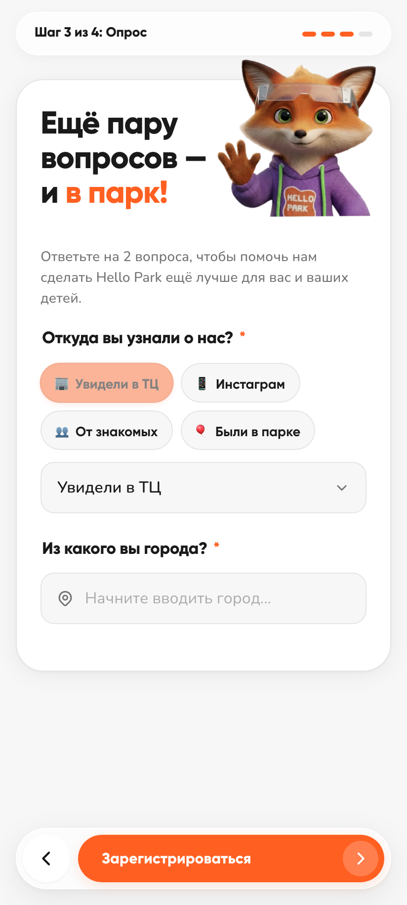
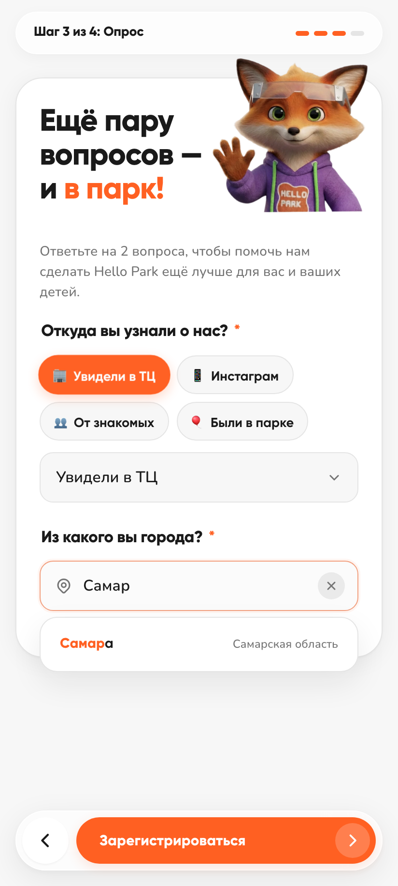

# Техническое задание: Шаг опроса в мобильной анкете гостя (Источник и Город)

Техническое задание на доработку и внедрение обязательного экрана сбора маркетинговых данных и географии гостей в мобильную анкету саморегистрации сети парков **Hello Park**.

---

## 1. Общие сведения и бизнес-цель

* **Модуль:** Мобильная веб-анкета гостя (`/guest-registration`).
* **Интерактивный веб-прототип:**
  * Локальный запуск: [http://127.0.0.1:3333/guest-registration/index.html](http://127.0.0.1:3333/guest-registration/index.html)
  * Репозиторий GitHub: [https://github.com/aihrtest-create/rfid-panel/tree/main/guest-registration](https://github.com/aihrtest-create/rfid-panel/tree/main/guest-registration)
* **Бизнес-цели:**
  1. **Сбор источников привлечения:** определение эффективности рекламных каналов (баннеры, ТЦ, соцсети, блогеры, сарафанное радио).
  2. **География посетителей:** фиксация города проживания для оценки доли местных жителей района, гостей из других округов и туристов.
  3. **Универсальность:** исключение ручной настройки под каждый парк сети (отказ от фиксированных плашек городов парка в пользу умного поиска по общей базе).
  4. **Высокая скорость прохождения:** заполнение занимает до 10–15 секунд благодаря быстрым чипсам и моментальному автокомплиту без зависимости от внешних API.

---

## 2. Место в пользовательском пути (CJM)

Анкета гостя расширена с 3 до **4 последовательных шагов**:

1. **Шаг 1 (Согласие):** Ввод номера телефона, подтверждение юридических согласий парка, верификация через 4-значный СМС-код.
2. **Шаг 2 (Данные семьи):** Ввод ФИО родителя и добавление детей (имя и дата рождения). Кнопка «Далее».
3. **Шаг 3 (Опрос — Новый обязательный шаг):** «Ещё пару вопросов — и в парк! 🎉». Ответ на 2 обязательных вопроса: источник и город. Кнопка «Зарегистрироваться».
4. **Шаг 4 (QR-код):** Экран успешной регистрации с динамическим QR-кодом для считывания на кассе и кнопками Apple / Google Wallet.

---

## 3. Визуальный интерфейс экрана опроса

### Общий вид экрана (Шаг 3)


### Работа умного автокомплита города


---

## 4. Спецификация экранных элементов и логика

### 4.1. Шапка экрана и персонаж
* **Прогресс-бар:** Плашка «Шаг 3 из 4: Опрос» с 4 сегментами (первые три активны, цвет `#FF6022`).
* **Заголовок:** Крупный акцентный заголовок: *«Ещё пару вопросов — и в парк!»*.
* **Персонаж:** 3D-маскот Лис в худи и защитных очках, создающий дружелюбный игровой тон.
* **Пояснение:** *«Ответьте на 2 вопроса, чтобы помочь нам сделать Hello Park ещё лучше для вас и ваших детей.»*.

---

### 4.2. Вопрос 1: «Откуда вы узнали о нас?»

* **Заголовок:** `Откуда вы узнали о нас? *` (стиль `.survey-question-title`, 1.05rem / 17px, начертание 800).
* **Быстрые чипсы (топ-4 ответа в 1 тап):**
  1. 🏢 **Увидели в ТЦ**
  2. 📱 **Инстаграм**
  3. 👥 **От знакомых**
  4. 🎈 **Были в парке**
* **Выпадающий список (все 12 вариантов):**
  * Стилизованный селектор с чистой векторной стрелочкой справа:
    * *от знакомых, сайт, инстаграм, интернет, увидели в ТЦ, экраны/баннеры в городе, реклама на/в транспорте, блогер, были в парке, постоянный клиент, не помню, другое.*
* **Синхронизация:** Выбор чипса переключает выпадающий список; выбор из списка подсвечивает соответствующий чипс.
* **Вариант «Другое»:** Плавно раскрывает текстовое поле `[ Уточните, пожалуйста, откуда... ]`.
* **Валидация:** Поле обязательное. При попытке перехода без выбора селектор подсвечивается ошибкой.

---

### 4.3. Вопрос 2: «Из какого вы города?»

* **Заголовок:** `Из какого вы города? *` (стиль `.survey-question-title`, 1.05rem / 17px, начертание 800).
* **Универсальность для всех парков:**
  * **Отсутствуют фиксированные плашки городов парка.** Это исключает необходимость ручной настройки под каждый парк сети.
* **Поле ввода:**
  * Иконка геолокации (пин) слева, плейсхолдер *«Начните вводить город...»*, кнопка очистки (✕) справа.
* **Автономная база (`cities.js`):**
  * Встроен локальный датасет на **1134 города РФ**, отсортированных по численности населения.
  * Работает на клиенте со скоростью **0 мс задержки**, без платных внешних API и без сбоев при слабом интернете в ТЦ.
* **Умный автокомплит (Live Search):**
  * Мгновенный поиск при вводе от 1 символа (топ-10 совпадений).
  * Подсветка совпавших букв оранжевым цветом.
  * Отображение субъекта/области РФ (например: **Московский** *(Москва)*, **Новомосковск** *(Тульская область)*).
  * Свободный ввод: не блокирует отправку, если гость ввёл редкий посёлок или иностранный город.
* **Валидация:** Обязательное поле (минимум 2 символа).

---

### 4.4. Навигация
* **Кнопка «Назад»:** возврат на Шаг 2 (Данные семьи) без потери данных.
* **Кнопка «Зарегистрироваться»:** проверяет поля опроса, генерирует QR-код лояльности и переводит на Шаг 4.

---

## 5. Формат данных для кассовой системы (Payload QR-кода)

```json
{
  "v": 1,
  "fio": "Иванова Мария Сергеевна",
  "phone": "+79991234567",
  "children": [
    { "name": "Александр", "dob": "2018-05-12" }
  ],
  "source": "увидели в ТЦ",
  "sourceOther": "",
  "city": "Самара",
  "ts": 1725965400000
}
```

Строка кодируется в Base64 с префиксом `HPARK:` и сохраняется в QR-коде.
